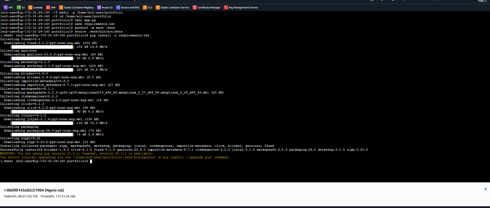
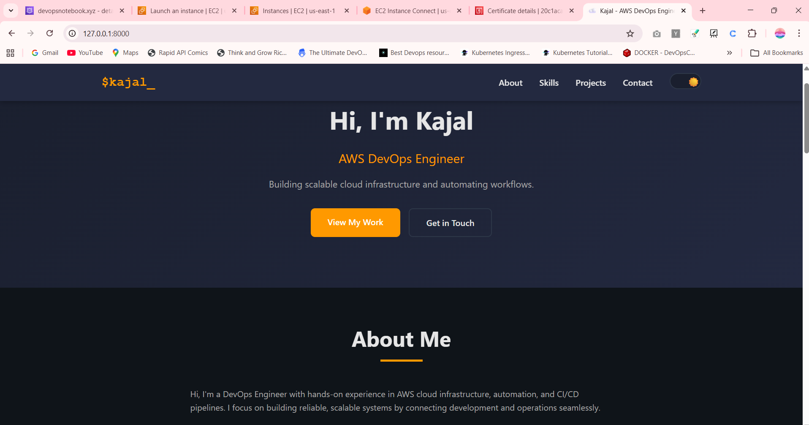
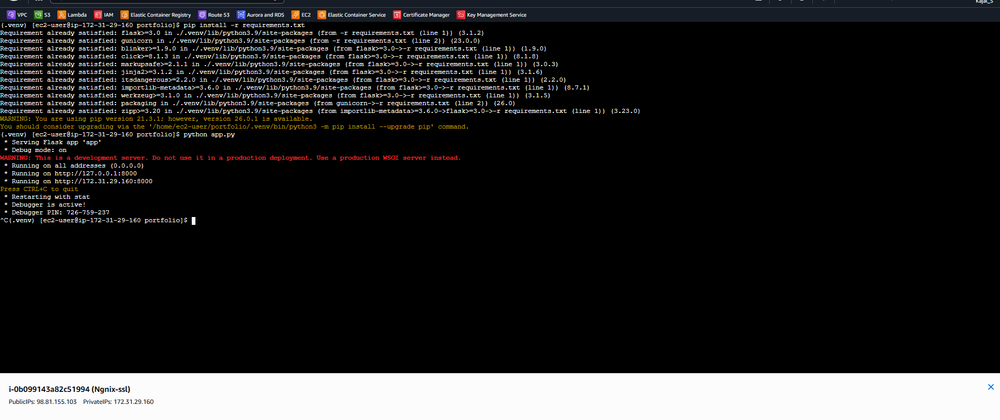
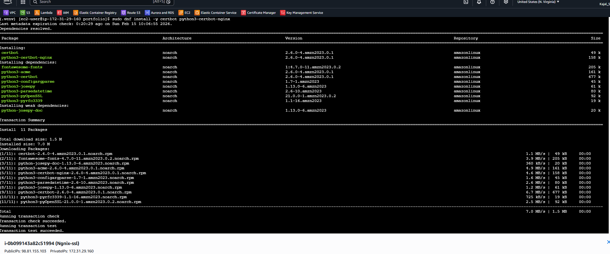
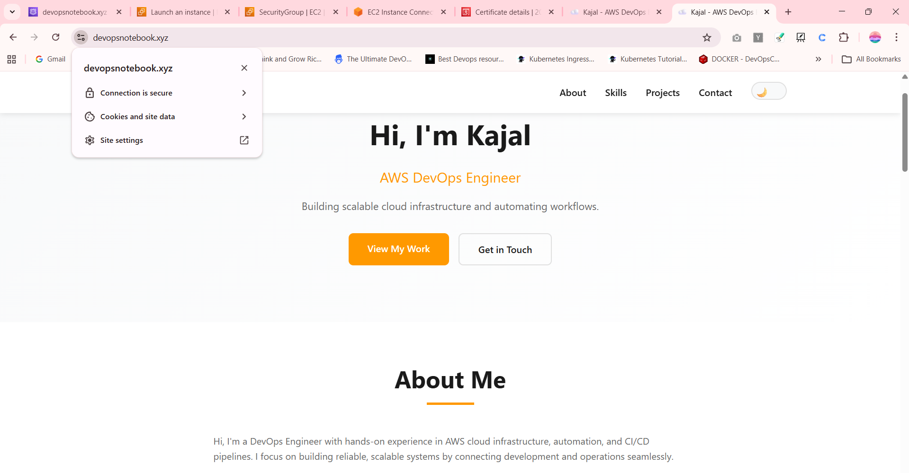
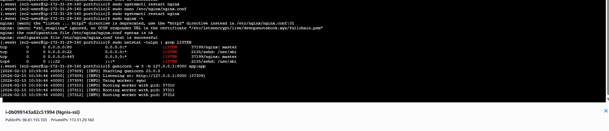

# 🚀 Complete NGINX Setup on AWS EC2 (Production Guide + SSL)

> Deploy a production-ready NGINX web server on AWS EC2 and secure it with SSL using Certbot.

---

# 📋 Table of Contents

- Overview
- Phase 1: Launch EC2 Infrastructure
- Phase 2: Install and Configure NGINX
- Phase 3: Host Custom Website
- Phase 4: Connect Domain
- Phase 5: Enable SSL with Certbot
- Important Files
- Common Commands
- Troubleshooting
- Cleanup
- Final Architecture

---

# 🌟 Overview

This guide walks you through:

- Launching an AWS EC2 instance
- Installing and configuring NGINX
- Hosting a custom website
- Connecting a domain
- Securing your site with HTTPS (Certbot SSL)

By the end, you'll have a production-ready web server running securely on AWS.

---

# 📌 Phase 1 — Launch EC2 Infrastructure

## Step 1️⃣ Launch EC2 Instance

Go to:

AWS Console → EC2 → Launch Instance


### Configuration

- **AMI:** Amazon Linux 2
- **Instance Type:** t2.micro (Free tier)
- **Key Pair:** Create or select existing
- **Storage:** 8 GB (default)

### Security Group Rules

| Type | Port | Source |
|------|------|--------|
| SSH  | 22   | My IP |
| HTTP | 80   | 0.0.0.0/0 |
| HTTPS| 443  | 0.0.0.0/0 |

Click **Launch Instance**.

---

## Step 2️⃣ Connect to EC2

### Using AWS Console

EC2 → Select Instance → Connect → EC2 Instance Connect


### OR Using SSH

```bash
chmod 400 nginx-key.pem
ssh -i nginx-key.pem ec2-user@YOUR_PUBLIC_IP
📌 Phase 2 — Install NGINX
Step 3️⃣ Update Server
sudo yum update -y
Step 4️⃣ Install NGINX
sudo yum install nginx -y
Step 5️⃣ Start and Enable NGINX
sudo systemctl start nginx
sudo systemctl enable nginx
sudo systemctl status nginx
If you see:

Active: active (running)
NGINX is running successfully.

Step 6️⃣ Test in Browser
Open:

http://YOUR_PUBLIC_IP
You should see:

Welcome to nginx!

📌 Phase 3 — Host Your Custom Website
Step 7️⃣ Create Website Directory
sudo mkdir -p /usr/share/nginx/html/mywebsite
Step 8️⃣ Create HTML File
sudo nano /usr/share/nginx/html/mywebsite/index.html
Paste your HTML content and save.

Step 9️⃣ Update NGINX Configuration
sudo nano /etc/nginx/nginx.conf
Find:

root /usr/share/nginx/html;
Change to:

root /usr/share/nginx/html/mywebsite;
Add inside the location block:

location / {
    try_files $uri $uri/ =404;
}
Step 🔟 Test & Reload
sudo nginx -t
sudo systemctl reload nginx
Visit:

http://YOUR_PUBLIC_IP
Your custom website is now live 🎉

📌 Phase 4 — Connect Domain (Required for SSL)
⚠️ SSL cannot be issued for a public IP. You must use a domain name.

Step 1️⃣ Purchase Domain (Optional)
You can use:

GoDaddy

Namecheap

Google Domains

Step 2️⃣ Point Domain to EC2
In your domain DNS settings, create:

Type	Name	Value
A Record	@	YOUR_PUBLIC_IP
Wait 5–10 minutes for DNS propagation.

Test:

http://yourdomain.com
If it loads successfully, proceed to SSL.

🔐 Phase 5 — Install Certbot SSL (HTTPS)
Step 1️⃣ Install Certbot
sudo yum install certbot python3-certbot-nginx -y
Step 2️⃣ Obtain SSL Certificate
Replace with your domain:

sudo certbot --nginx -d yourdomain.com -d www.yourdomain.com
You will be prompted for:

Email address

Terms agreement

HTTP to HTTPS redirect

Choose:

2: Redirect
Certbot will:

Generate SSL certificate

Update NGINX configuration

Enable HTTPS

Add automatic HTTP → HTTPS redirect

Step 3️⃣ Test HTTPS
Open:

https://yourdomain.com
You should see:

🔒 Secure connection (Green lock)

📌 Verify Auto-Renewal
Test renewal process:

sudo certbot renew --dry-run
If no errors appear, auto-renewal is working correctly.

📂 Important Files
File	Purpose
/etc/nginx/nginx.conf	Main NGINX configuration
/etc/letsencrypt/live/	SSL certificate files
/var/log/nginx/access.log	Access logs
/var/log/nginx/error.log	Error logs

🔄 Common NGINX Commands
sudo systemctl start nginx
sudo systemctl stop nginx
sudo systemctl restart nginx
sudo systemctl reload nginx
sudo nginx -t

🐛 Troubleshooting SSL
If SSL fails:

sudo nginx -t
sudo systemctl status nginx
sudo tail -50 /var/log/nginx/error.log
Common issues:

DNS not propagated

Port 80 blocked

Incorrect domain name

🧹 Cleanup (Avoid AWS Charges)
To prevent charges:

EC2 → Terminate Instance

Release Elastic IP (if used)

Delete Security Group (optional)

✅ Final Architecture
Without SSL
User
 ↓
Domain
 ↓
NGINX (EC2)
 ↓
HTML Website


With SSL
User
 ↓
HTTPS (443)
 ↓
NGINX + Certbot
 ↓
Website


## 📸 Screenshots

---

### Installation



---
### Test Your Web Server

Open browser and navigate to:
```



```
---



---

###  Enable SSL with Certbot




---

### 🔐 HTTPS Working (Green Padlock)



---

---
### Ngnix


---


