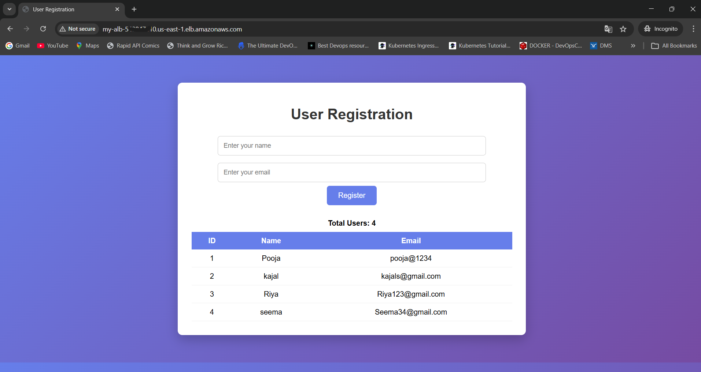

# AWS Two-Tier Flask Application Deployment (End-to-End)

Architecture you will build:

```
Internet
   │
Application Load Balancer
   │
Auto Scaling Group (EC2)
   │
Flask App (Gunicorn)
   │
Amazon RDS PostgreSQL
```

---

# Step 1 — Create VPC

Go to:

```
AWS Console → VPC → Create VPC
```

Settings:

| Setting | Value       |
| ------- | ----------- |
| Name    | devops-vpc  |
| CIDR    | 10.0.0.0/16 |

Click **Create VPC**

---

# Step 2 — Create Subnets

Create **4 subnets**

| Name             | CIDR        | AZ          | Type    |
| ---------------- | ----------- | ----------- | ------- |
| public-subnet-1  | 10.0.1.0/24 | ap-south-1a | Public  |
| public-subnet-2  | 10.0.2.0/24 | ap-south-1b | Public  |
| private-subnet-1 | 10.0.3.0/24 | ap-south-1a | Private |
| private-subnet-2 | 10.0.4.0/24 | ap-south-1b | Private |

---

# Step 3 — Create Internet Gateway

Go to

```
VPC → Internet Gateway → Create
```

Name:

```
devops-igw
```

Attach it to **devops-vpc**

---

# Step 4 — Create Route Tables

### Public Route Table

Go to:

```
VPC → Route Tables → Create
```

Name:

```
public-rt
```

Add route:

```
0.0.0.0/0 → Internet Gateway
```

Associate:

```
public-subnet-1
public-subnet-2
```

---

# Step 5 — Create NAT Gateway

Go to:

```
VPC → NAT Gateway → Create
```

Settings:

| Setting    | Value           |
| ---------- | --------------- |
| Subnet     | public-subnet-1 |
| Elastic IP | Allocate        |

Create NAT Gateway.

Wait until **Available**.

---

# Step 6 — Private Route Table

Create new route table:

```
private-rt
```

Add route:

```
0.0.0.0/0 → NAT Gateway
```

Associate:

```
private-subnet-1
private-subnet-2
```

Now private EC2 can access internet through NAT.

---

# Step 7 — Create Security Groups

---

## ALB Security Group

Name:

```
alb-sg
```

Inbound rules:

| Type | Port | Source    |
| ---- | ---- | --------- |
| HTTP | 80   | 0.0.0.0/0 |

---

## EC2 Security Group

Name:

```
ec2-sg
```

Inbound rules:

| Type       | Port | Source  |
| ---------- | ---- | ------- |
| Custom TCP | 5000 | alb-sg  |
| SSH        | 22   | Your IP |

---

## RDS Security Group

Name:

```
rds-sg
```

Inbound rules:

| Type       | Port | Source |
| ---------- | ---- | ------ |
| PostgreSQL | 5432 | ec2-sg |

---

# Step 8 — Create RDS PostgreSQL

Go to:

```
AWS → RDS → Create database
```

Settings:

| Setting  | Value       |
| -------- | ----------- |
| Engine   | PostgreSQL  |
| Template | Free tier   |
| Instance | db.t3.micro |
| Storage  | 20 GB       |

---

### Database settings

| Setting       | Value      |
| ------------- | ---------- |
| DB identifier | jan26week3 |
| Username      | postgres   |
| Password      | Admin1234  |

---

### Connectivity

| Setting        | Value      |
| -------------- | ---------- |
| VPC            | devops-vpc |
| Public access  | No         |
| Security group | rds-sg     |

---

Database name:

```
jan26week3
```

Create database.

After creation copy **endpoint**

Example:

```
jan26week3.cvik8accw2tk.ap-south-1.rds.amazonaws.com
```

This matches your `.env` file 👍

---

# Step 9 — GitHub Repository

Your repo structure should be:

```
DEVOPS-2026
        │
        └── week3
              │
              └── day2
                    │
                    └── app
                        │
                        ├── .env
                        ├── app.py
                        ├── requirements.txt
                        └── run.sh
```

Push code to GitHub.

---

# Step 10 — Create Launch Template

Go to:

```
EC2 → Launch Templates → Create
```

Settings:

| Setting        | Value              |
| -------------- | ------------------ |
| Name           | flask-app-template |
| AMI            | Amazon Linux       |
| Instance type  | t3.micro           |
| Key pair       | your key           |
| Security group | ec2-sg             |

Disable **Auto assign public IP**

---

### User Data Script

Paste your script:

```bash
#!/bin/bash

sleep 30
sudo yum update -y

echo "Installing git" >> /home/ec2-user/install.log
sudo yum install git -y 

sudo yum update -y
sudo yum install git python3 python3-pip -y

cd /home/ec2-user
echo "$(pwd) " >> /home/ec2-user/install.log


echo "cloning code " >> /home/ec2-user/install.log
git clone https://github.com/RiverByte9/DevOps-2026

cd DevOps-2026/Week-3/Day-2/app

echo "in app $(pwd) " >> /home/ec2-user/install.log

chmod u+x run.sh

echo "Starting the app " >> /home/ec2-user/install.log

./run.sh 

```

Create template.

---

# Step 11 — Create Target Group

Go to:

```
EC2 → Target Groups → Create
```

Settings:

| Setting     | Value     |
| ----------- | --------- |
| Target type | Instances |
| Protocol    | HTTP      |
| Port        | 5000      |

Health check:

```
Path: /
Port: 5000
```

---

# Step 12 — Create Application Load Balancer

Go to:

```
EC2 → Load Balancer → Create
```

Settings:

| Setting        | Value                            |
| -------------- | -------------------------------- |
| Type           | Application                      |
| Scheme         | Internet-facing                  |
| Subnets        | public-subnet-1, public-subnet-2 |
| Security group | alb-sg                           |

Listener:

```
HTTP 80 → Forward to Target Group
```

Create ALB.

---

# Step 13 — Create Auto Scaling Group

Go to:

```
EC2 → Auto Scaling Groups → Create
```

Settings:

| Setting         | Value                              |
| --------------- | ---------------------------------- |
| Name            | flask-asg                          |
| Launch Template | flask-app-template                 |
| Subnets         | private-subnet-1, private-subnet-2 |

Attach to **target group**.

---

### Capacity

| Setting | Value |
| ------- | ----- |
| Min     | 1     |
| Desired | 1     |
| Max     | 3     |

Scaling policy:

```
Target tracking
CPU Utilization = 60%
```

Create ASG.

---

# Step 14 — Wait for Instance

Go to:

```
EC2 → Instances
```

You will see **1 instance launched automatically**.

---

# Step 15 — Check Target Group

Go to:

```
EC2 → Target Groups → Targets
```

Status should become:

```
Healthy
```


If unhealthy wait **1–2 minutes**.

---

# Step 16 — Test Application

Go to:

```
EC2 → Load Balancers
```

Copy **DNS name**

Example:

```
flask-alb-123456.ap-south-1.elb.amazonaws.com
```

Open browser:

```
http://ALB-DNS
```

You will see:


```
User Registration Form
```

Add user → data will be saved in **RDS PostgreSQL**.

---

# Step 17 — Verify Database

SSH into EC2 instance.

Install postgres client:

```
sudo yum install postgresql15 -y
```

Connect:

```
psql -h jan26week3.cXXXXX5r.ap-south-1.rds.amazonaws.com -U postgres -d jan26week3
```

Check table:

```
select * from "user";
```

---

# Step 18 — Test Auto Scaling

Generate CPU load:

```
sudo yum install stress -y

stress --cpu 4 --timeout 300
```

Check:

```
Auto Scaling → Activity
```

New instance should launch.

---

# Step 19 — Cleanup (Important)

Delete resources to avoid charges:

1. Delete Auto Scaling Group
2. Delete Load Balancer
3. Delete Target Group
4. Delete Launch Template
5. Delete RDS
6. Delete NAT Gateway
7. Delete Subnets
8. Delete VPC

---

# 🎯 What You Learned

This project demonstrates:

✅ VPC networking
✅ Public vs Private Subnets
✅ NAT Gateway
✅ Security Groups
✅ Application Load Balancer
✅ Auto Scaling Group
✅ Flask + Gunicorn deployment
✅ RDS PostgreSQL integration

---


