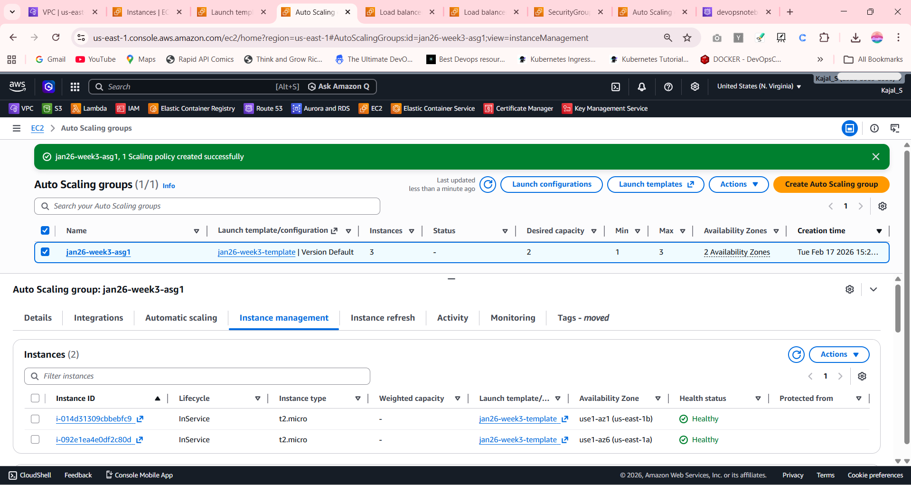
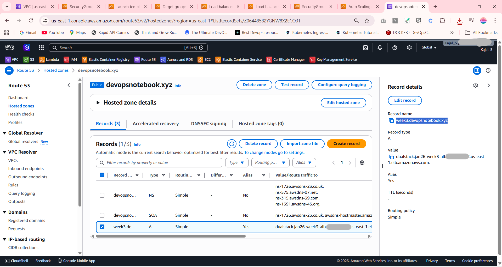
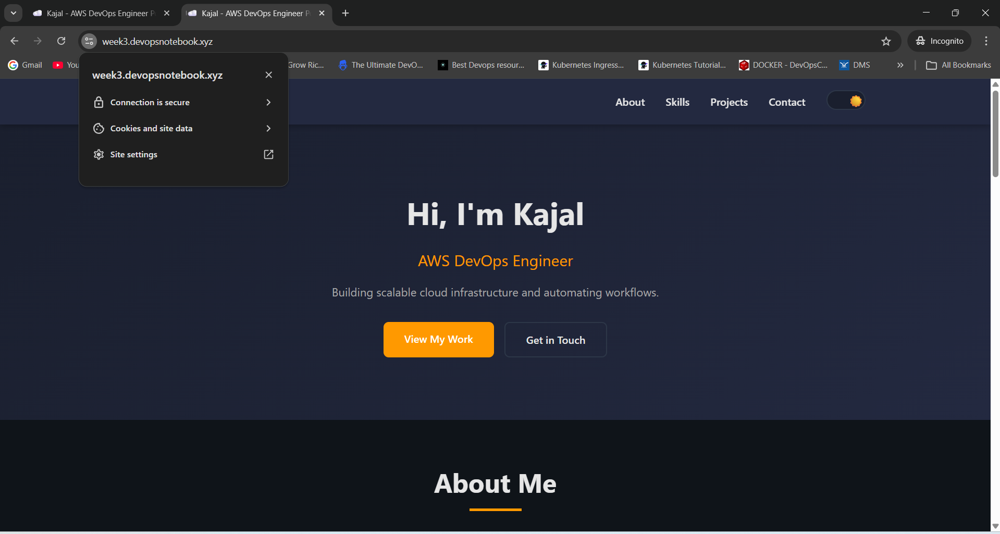
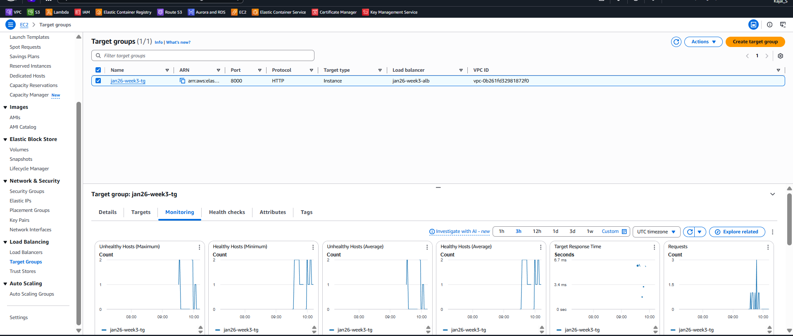

#  Week 3 – Auto Scaling Group with Application Load Balancer

---

## 📌 Project Overview

This project demonstrates deployment of a Flask application using:

- Auto Scaling Group (ASG)
- Application Load Balancer (ALB)
- Target Group
- Route 53 DNS
- SSL Certificate (HTTPS via ACM)
- CPU-based Auto Scaling

The architecture ensures:

- High Availability (Multi-AZ)
- Horizontal Scaling
- Load Distribution
- Secure HTTPS Access

---

## 🏗 Architecture

User
↓
Domain (Route 53)
↓
Application Load Balancer (ALB)
↓
Target Group
↓
Auto Scaling Group (ASG)
↓
EC2 Instances (Flask App running on port 8000)

---

## 🌐 Infrastructure Details

### VPC Configuration

- Custom VPC: `jan26-vpc`
- CIDR: `10.0.0.0/16`
- 2 Public Subnets:
  - ap-south-1a
  - ap-south-1b
- Internet Gateway attached
- Public Route Table configured

---

## 🖥 Application Setup

- Flask application runs on:

0.0.0.0:8000

- No Nginx used (ALB handles reverse proxy)
- Deployment automated using EC2 User Data script
- Application pulled from GitHub during instance launch

---

## 🚀 Launch Template Configuration

- AMI: Amazon Linux 2023
- Instance Type: t2.micro
- Security Group:
- SSH (22)
- Custom TCP (8000)
- User Data Script:
- Installs Git & Python
- Clones repository
- Runs Flask application

---

## 🔄 Auto Scaling Group Configuration

- Desired Capacity: 2
- Minimum Capacity: 1
- Maximum Capacity: 3
- Scaling Policy:
- Target tracking
- CPU Utilization: 70%

Health Checks:

- EC2 + ELB health checks enabled

---

## ⚖ Application Load Balancer

- Internet-facing
- Deployed in 2 Availability Zones
- Listeners:
- HTTP (80)
- HTTPS (443)
- Forwarding to:
- Target Group (port 8000)

---

## 🎯 Target Group

- Target Type: Instances
- Protocol: HTTP
- Port: 8000
- Health Check:
- Path: `/`
- Port: 8000

Healthy targets automatically registered via ASG.

---

## 🔐 HTTPS Configuration

- SSL Certificate created using AWS Certificate Manager
- DNS validation via Route 53
- HTTPS Listener added to ALB
- Valid SSL with green lock enabled

---

## 🌍 DNS Configuration

- Subdomain created:

week3.yourdomain.com

- Record Type:
- A (Alias)
- Points to:
- Application Load Balancer

---

## 🧪 Auto Scaling Testing

### 🔼 Scale Up Test

- CPU stress generated on instance
- ASG scaled from 2 → 3 instances automatically

### 🔽 Scale Down Test

- After load stopped
- ASG scaled down to 1–2 instances

### 🛡 High Availability Test

- Manual instance termination
- ASG automatically launched replacement
- No downtime observed

---

## 📊 Verification Methods

- Checked ASG Instance Management
- Verified Target Group health
- Confirmed ALB distributing traffic
- Monitored CloudWatch CPU metrics

---

## 🧹 Cleanup Steps

Deleted in correct order to avoid charges:

1. ALB
2. Target Group
3. Auto Scaling Group
4. Launch Template
5. ACM Certificate
6. Route 53 record

(VPC retained for future use)

---

## 📸 Screenshots

---

### 🚀 Auto Scaling Group (2 Instances Running)

---

### 🎯 Target Group - Healthy Targets

---

### ⚖️ Application Load Balancer Listeners

---

### 📝 Route 53 Record

---

### 🔐 HTTPS Working (Green Padlock)

---

### 📈 Auto Scaling Activity

---

## ✅ Outcome

✔ Highly Available Application  
✔ Load Balanced Traffic  
✔ Automatic Scaling  
✔ Secure HTTPS Enabled  
✔ Production-Ready Architecture  

---