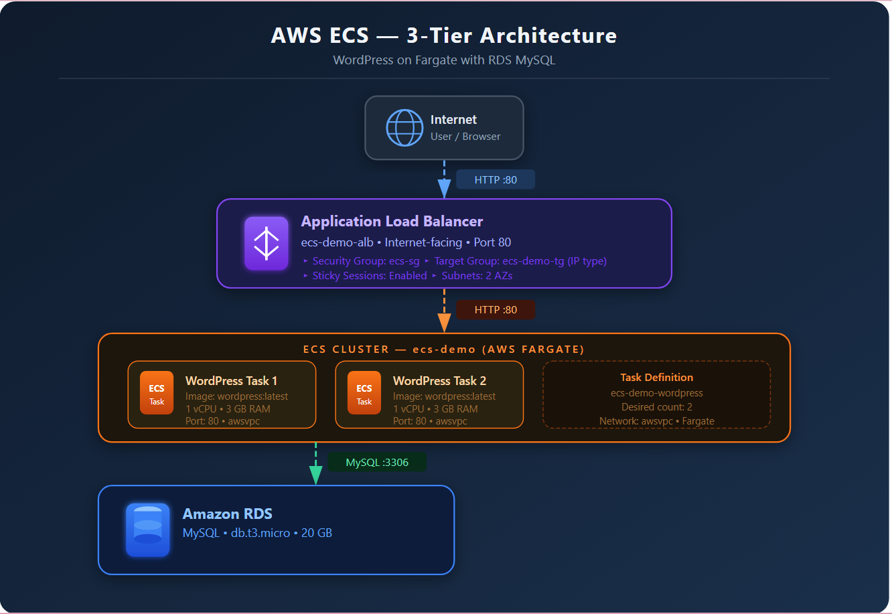

# Deploying a 3-Tier Production Application on AWS ECS

A complete guide to deploying a WordPress application on AWS ECS using Fargate, Application Load Balancer, and RDS MySQL — no EC2 management required.

---

## Architecture Overview

```
Internet
    │
    ▼
Application Load Balancer (Public)
    │  Port 80
    ▼
ECS Fargate Tasks - WordPress (Default VPC)
    │  Port 3306
    ▼
RDS MySQL (Private, No Public Access)
```

## AWS Services Used

| Service | Purpose |
|---|---|
| Amazon ECS | Container orchestration |
| AWS Fargate | Serverless compute for containers |
| Application Load Balancer | Traffic distribution |
| Amazon RDS (MySQL) | Database layer |
| AWS Secrets Manager | Store RDS credentials securely |
| Amazon CloudWatch | Container logging |

---

## Prerequisites

- An AWS account with appropriate permissions
- Basic understanding of AWS Console navigation
- Your AWS Account ID (find it in top-right corner of AWS Console)

---

## Step 1 — Create an ECS Cluster

1. Go to **AWS Console → ECS → Clusters → Create Cluster**
2. Cluster name: `ecs-demo`
3. Infrastructure: **AWS Fargate**
4. Click **Create**

> The cluster itself has no cost. You are only charged for tasks that run inside it.

---

## Step 2 — Create a Task Definition

1. Go to **ECS → Task Definitions → Create new task definition**
2. Choose **Create with JSON**
3. Paste the following JSON and replace `<AWS_ACCOUNT_ID>` with your actual account ID:

```json
{
  "requiresCompatibilities": ["FARGATE"],
  "family": "ecs-demo-wordpress",
  "containerDefinitions": [
    {
      "name": "ecs-demo-wordpress",
      "image": "wordpress",
      "essential": true,
      "portMappings": [
        {
          "name": "http",
          "containerPort": 80,
          "hostPort": 80,
          "protocol": "tcp",
          "appProtocol": "http"
        }
      ]
    }
  ],
  "volumes": [],
  "networkMode": "awsvpc",
  "memory": "3 GB",
  "cpu": "1 vCPU",
  "executionRoleArn": "arn:aws:iam::<AWS_ACCOUNT_ID>:role/ecsTaskExecutionRole"
}
```

4. Click **Create**

> Note: Container port and host port must both be 80.

---

## Step 3 — Create a Security Group for ECS

1. Go to **EC2 → Security Groups → Create security group**
2. Name: `ecs-sg`
3. VPC: **default VPC**
4. Inbound rules:
   - Type: HTTP | Port: 80 | Source: 0.0.0.0/0
5. Outbound rules: All traffic (default)
6. Click **Create**

---

## Step 4 — Create an Application Load Balancer

1. Go to **EC2 → Load Balancers → Create Load Balancer**
2. Type: **Application Load Balancer**
3. Name: `ecs-demo-alb`
4. Scheme: **Internet-facing**
5. VPC: **default VPC**
6. Subnets: select **at least 2 subnets** in different availability zones
7. Security group: `ecs-sg`
8. Listener: HTTP port 80
9. Target group — click **Create target group**:
   - Target type: **IP**
   - Name: `ecs-demo-tg`
   - Protocol: HTTP | Port: 80
   - VPC: default VPC
   - Click **Next → Create target group**
10. Back on ALB page, select `ecs-demo-tg`
11. Click **Create load balancer**

> Copy and save the ALB DNS name — you will use it to access WordPress.

---

## Step 5 — Create the ECS Service

1. Go to **ECS → Clusters → ecs-demo → Services → Create**
2. Launch type: **Fargate**
3. Task definition: `ecs-demo-wordpress` (latest)
4. Service name: `wordpress-service`
5. Desired tasks: **2**
6. Networking:
   - VPC: default VPC
   - Subnets: select 2–3 subnets
   - Security group: `ecs-sg`
   - Public IP: **Enabled**
7. Load balancing:
   - Type: Application Load Balancer
   - Load balancer: `ecs-demo-alb` (existing)
   - Container: `ecs-demo-wordpress:80`
   - Listener: **80:HTTP (existing)** — do NOT create new
   - Target group: `ecs-demo-tg` (existing) — do NOT create new
8. Click **Create service**
9. Wait until tasks show status **RUNNING**

---

## Step 6 — Create RDS MySQL Database

1. Go to **RDS → Create database**
2. Creation method: **Standard create**
3. Engine: **MySQL**
4. Template: **Free tier**
5. DB instance identifier: `wordpress`
6. Master username: `admin`
7. Master password: tick **"Manage master credentials in AWS Secrets Manager"**
8. Instance class: `db.t3.micro`
9. Storage: default (20 GB gp2)
10. Encryption: **Disable** (for demo)
11. Connectivity:
    - VPC: default VPC
    - Public access: **No**
    - Security group: create new or use existing
      - Must allow **port 3306 inbound** from VPC CIDR (e.g. `172.31.0.0/16`) or `0.0.0.0/0` for demo
12. Expand **Additional configuration**:
    - Initial database name: `wordpress` ⚠️ required — RDS will not create a DB without this
13. Click **Create database**
14. Wait until status shows **Available**

---

## Step 7 — Get DB Credentials from Secrets Manager

1. Go to **AWS Console → Secrets Manager**
2. Find the auto-created secret named like `rds!db-xxxxxxxx-...`
3. Click on it → scroll to **Secret value**
4. Click **Retrieve secret value**
5. Copy the **username** and **password**
6. Also copy the **RDS endpoint** from RDS → your instance → Connectivity & security tab

---

## Step 8 — Connect WordPress to the Database

1. Open browser → `http://<ALB-DNS-name>`
2. WordPress setup page appears → click **Let's go**
3. Fill in:
   - Database name: `wordpress`
   - Username: `admin`
   - Password: (from Secrets Manager)
   - Database host: (RDS endpoint)
   - Table prefix: `wp_`
4. Click **Submit**
5. Click **"installing now"** on the next screen
6. Fill in site title, admin username, password, email
7. Click **Install WordPress**

---

## Troubleshooting

### 502 Bad Gateway / Unhealthy Targets

The ECS task security group or RDS security group is blocking traffic.

**Fix:**
- Go to **EC2 → Security Groups → RDS security group**
- Add inbound rule: MySQL/Aurora | Port 3306 | Source: `0.0.0.0/0`
- Go to **EC2 → Security Groups → ecs-sg**
- Confirm inbound HTTP 80 and outbound All traffic are set
- Then go to **ECS → Services → wordpress-service → Update → Force new deployment**

---

### Listener Port Already Exists Error

When creating the ECS service, the ALB listener on port 80 already exists.

**Fix:** In the load balancer section, select **"Use existing listener"** (80:HTTP) and **"Use existing target group"** instead of creating new ones.

---

### WordPress Installation Not Proceeding (wp-config.php exists)

With 2 ECS tasks running, each request may hit a different task causing session issues.

**Fix — Enable Sticky Sessions:**
1. Go to **EC2 → Target Groups → ecs-demo-tg**
2. Click **Actions → Edit attributes**
3. Enable **Stickiness**:
   - Type: Load balancer generated cookie
   - Duration: 1 day
4. Save changes
5. Force new deployment on the ECS service

---

### No Secret in Secrets Manager

If no secret was auto-created, it means you typed the password manually during RDS setup instead of using Secrets Manager. Just use the password you entered directly — no need for Secrets Manager.

---

## Accessing the Application

Once installation is complete, access your WordPress site at:

```
http://<ALB-DNS-name>
```

The ALB DNS name looks like:
```
ecs-demo-alb-xxxxxxxxxx.us-east-1.elb.amazonaws.com
```

---

## Clean Up (Avoid Unnecessary Charges)

When done, delete resources in this order to avoid charges:

1. ECS Service → set desired count to 0, then delete
2. ECS Cluster → delete
3. RDS Instance → delete (skip final snapshot for demo)
4. ALB → delete
5. Target Group → delete
6. Security Groups → delete
7. Secrets Manager secret → delete

---

## Production Improvements

If moving this to a real production environment:

- **HTTPS** — Add SSL certificate via AWS Certificate Manager
- **Custom VPC** — Use private subnets for ECS and RDS instead of default VPC
- **WAF** — Attach AWS Web Application Firewall to the ALB
- **Auto Scaling** — Configure ECS service auto scaling based on CPU/memory
- **Multi-AZ RDS** — Enable for automatic database failover
- **Amazon EFS** — Mount for persistent WordPress file uploads
- **Enable Encryption** — Enable RDS encryption at rest for sensitive data
- **Secrets Manager** — Already used here — keep this in production too

---

## Aws_ecs_architecture



## References

- [LivingDevOps — Deploying a 3-Tier Production Application on AWS ECS](https://livingdevops.com/aws/deploying-a-3-tier-production-application-on-aws-ecs-a-complete-guide/)
- [AWS ECS Documentation](https://docs.aws.amazon.com/ecs/)
- [AWS Fargate Documentation](https://docs.aws.amazon.com/AmazonECS/latest/developerguide/AWS_Fargate.html)
- [Amazon RDS Documentation](https://docs.aws.amazon.com/rds/)

